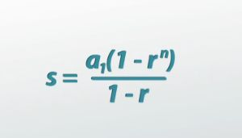
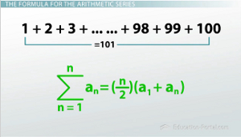

#Formulas

summing a geometric series

summing an arithmetic series

Permutations of n items in a fixed circle = n! / n = (n - 1)!

Permutations of n items in a free circle = n! / 2n = (1 / 2) * (n-1)!

In a first-order recurrence relation, the current value depends on a value occurring one unit of time earlier. That is, un depends on un-1

bijection: both injection and surjection, includes all possible outputs of a given function, size of domain = size of codomain

prim's algorithm: find the minimum spanning tree of a weighted graph by starting at a random vertex and adding the lowest weight edge to the tree

kruskal's algorithm: Finding the minimum spanning tree by adding links purely in order of weights, rejecting any links which produce a loop

There are 8 possible euler circuits in a complete graph with 4 vertices

inverse vs converse vs contrapositive: inverse is negating both the hypothesis and the conclusion, converse is switching the hypothesis and the conclusion, contrapositive is negating both and switching them

A statement can be proven what through a direct proof? True or False

The independent variable is the input of a function (x), the dependent variable is the output of a function (y)

injection vs surjection vs bijection: injection is one-to-one, surjection is onto, bijection is both

A bijection is a function that is both one-to-one and onto (injective and surjective), a function is bijective if and only if it has an inverse function (a function that undoes the original function)

why are inverses important to isomorphisms? 

Solve the permutation 7p2. 7! / (7 - 2)! = 7! / 5! = 7 * 6 = 42

If you have a circular arrangement of 3 items, how many ways can you arrange them? 2. show work. 3! / 3 = 2. What if the circle is fixed? 

The local bowling team plays in a 7 team league where each team plays other teams 4 times in a season. Using the combination formula, how many games will the team play in a season? 7c2 * 4 = 7! / (2! * (7 - 2)!) * 4 = 21 * 4 = 84

Solve the combination 10c7. 10! / (7! * (10 - 7)!) = 10! / (7! * 3!) = 10 * 9 * 8 / 3 * 2 * 1 = 120

standard deviation formula: sqrt(nP(1 - P))

fleury's algorithm: find an euler circuit by starting at a random vertex and adding the lowest weight edge to the tree, but if there is a vertex with an odd number of edges, start there

preorder vs inorder vs postorder vs reorder: preorder is root, left, right, inorder is left, root, right, postorder is left, right, root, reorder is root, right, left